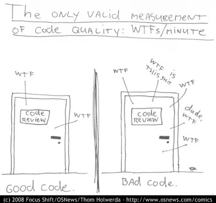
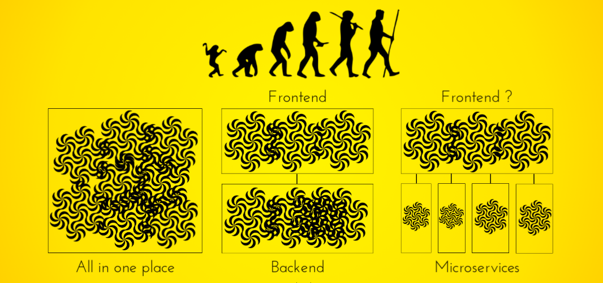
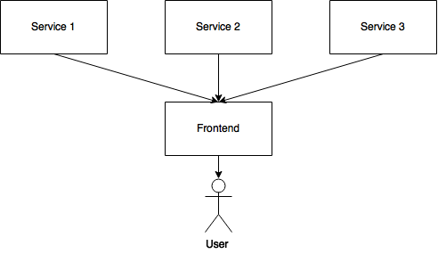
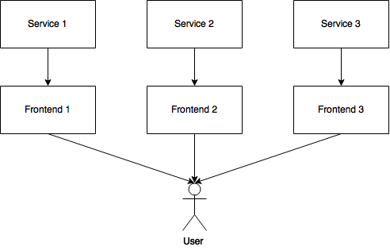
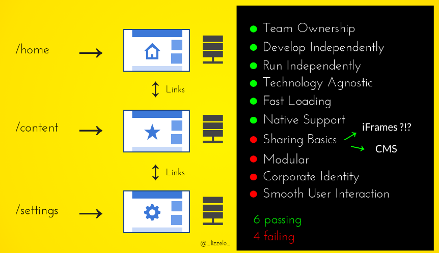
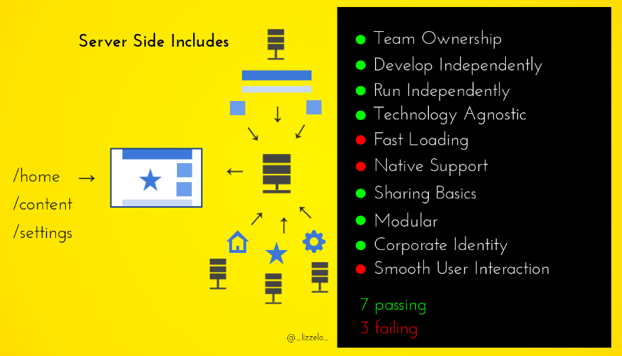
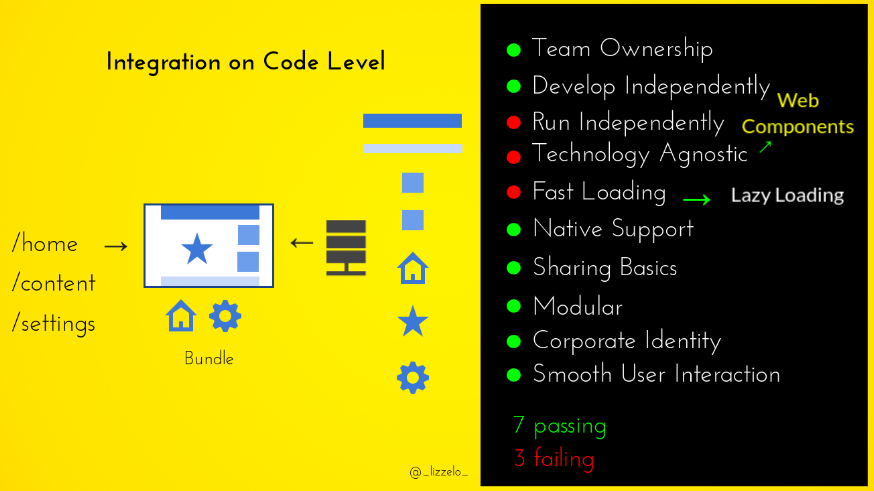
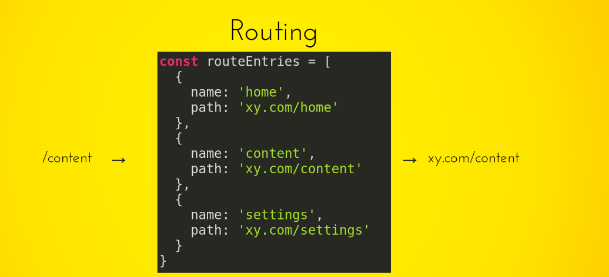
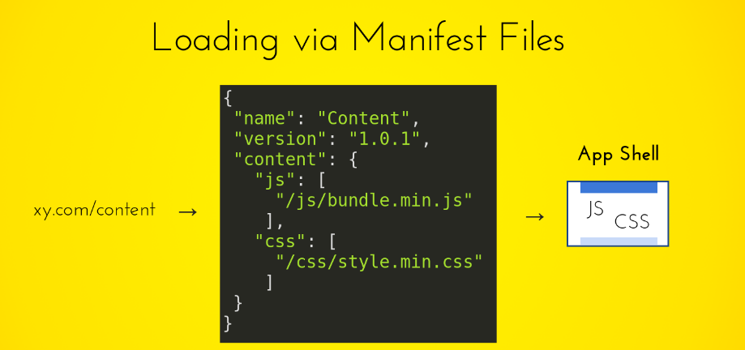
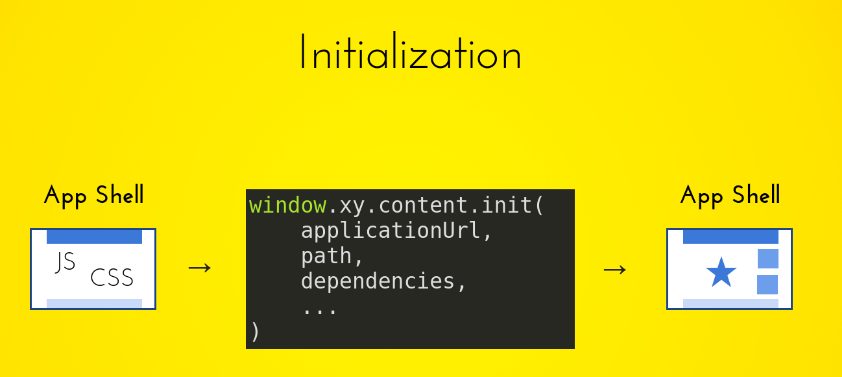

## Introduction

> Loose coupling allows you to make changes to one module without affecting the others.


* Engine is an application development framework designed to take care of the connection points between existing popular frameworks and solve common integration problems with MongoDB, Node.js, Express, Web Services adapter and Angular, React, Vue, Mithril (any modern ui development framework) based applications. It is designed to give you a quick and organised way to start developing engine based web apps.


* Engine promotes age-old idea of building smaller, loosely coupled, reusable piece of software that does one thing and one thing well for quicker time to market and cheaper cost of change.

* Everything in engine is a package and when need arises for extending engine with custom functionality , developers can do so creating their own package and do not need to alter the core packages.

* The engine package system allows developers to create modular code that provides useful tools that other engine developers can use. The packages, when published, are plug-and-play and are used in a way very similar to traditional npm packages.


* The engine package system integrates all the packages into the engine project as if the code was part of engine itself and provides the developers with all the necessary tools required to integrate their package into the host project.


## Philosophy

>Any organisation that designs a system (defined broadly) will produce a design whose structure is a copy of the organisation's communication structure. - Conway's Law

Lets try to figure out what goes wrong with Software in general, but first we need to understand a bit more about what is Programming.

Some people argue, programming is more of an art than science. One thing we can be certain is that Computer Science and Engineering is relatively new if one compares it with classical and established engineering disciplines such as Mechanical , Chemical and Civil Engineering etc.


>You also have to develop a kind of faith in your own learning capacity — a belief that even though you may not know all of what you need to solve a problem, if you tackle just a piece of it and learn from that, you'll learn enough to solve the next piece — and so on, until you're done.

A cynical person may argue that programming is science which we have dressed up as art over the recent times in order to cover up our lack of understanding about the physics of software.

Most Software Engineers tend to believe physics of software is algorithms, data structures, languages , testing suite and abstractions etc, however these are just tools we make, use, throwaway and move forward in life. Can we ever figure out the physics of software in our lifetime and learn to develop good and sustainable software ? 

The real physics of software is the physics of people specifically, our limitations when it comes to complexity, and our desire to work together to solve large problems in pieces.This is the science of programming: make building blocks that people can understand and use easily, and people will work together to solve the very largest problems.


> TLDR: In recent years, thanks to Node.js, JavaScript has become the “lingua franca” of the web for both front and backend applications. This has given rise to awesome projects like Angular, React and Vue which improve developer productivity and enable the construction of fast, testable, and extensible frontend applications. However, while plenty of superb libraries, helpers, and tools exist for Node (and server-side JavaScript), none of them effectively solve the main problem - architecture.

> engine provides an out-of-the-box application architecture which allows for effortless creation of highly testable, scalable, loosely coupled, and easily maintainable  largescale frontend web applications as set of independent micro frontends.

## A Big Ball of Mud

>While much attention has been focused on high-level software architectural patterns, what is, in effect, the de-facto standard software architecture is seldom discussed. This paper examines this most frequently deployed of software architectures: the BIG BALL OF MUD. A BIG BALL OF MUD is a casually, even haphazardly, structured system. Its organisation, if one can call it that, is dictated more by expediency than design. Yet, its enduring popularity cannot merely be indicative of a general disregard for architecture.- http://www.laputan.org/mud/

Our existing Web Application is haphazardly structured, sprawling, sloppy, duct-tape and bailing wire, spaghetti code jungle. This system is showing unmistakable signs of unregulated growth, and repeated, expedient repair.
Information is shared promiscuously among distant elements of the system, often to the point where nearly all the important information becomes global or duplicated. The overall structure of the system may never have been well defined. If it was, it may have eroded beyond recognition. Programmers with a shred of architectural sensibility shun these quagmires. Only those who are unconcerned about architecture, and, perhaps, are comfortable with the inertia of the day-to-day chore of patching the holes in these failing dikes, are content to work on such systems.
Still, this approach endures and thrives and Big Ball of Mud has been proven Software Design Pattern . Why is this architecture so popular? Is it as bad as it seems, or might it serve as a way-station on the road to more enduring, elegant artifacts? What forces drive good programmers to build ugly systems? Can we avoid this? Should we? How can we make such systems better?

Why does a system become a BIG BALL OF MUD? Sometimes, big, ugly systems emerge from THROWAWAY CODE. THROWAWAY CODE is quick-and-dirty code that was intended to be used only once and then discarded. However, such code often takes on a life of its own, despite casual structure and poor or non-existent documentation. It works, so why fix it? When a related problem arises, the quickest way to address it might be to expediently modify this working code, rather than design a proper, general program from the ground up. Over time, a simple throwaway program begets a BIG BALL OF MUD.
<p align="center">
  
</p>

How can we make sure we wind up behind the right door when the going gets tough?
The answer is: craftsmanship.
There are two parts to learning craftsmanship: knowledge and work. You must gain
the knowledge of principles, patterns, practices, and heuristics that a craftsman knows, and
you must also grind that knowledge into your fingers, eyes, and gut by working hard and practising.

Even our system at the time of its creation, was a well-defined architecture. The relentless onslaught of changing requirements that any successful system attracts can gradually undermine its structure. Systems that was once tidy become overgrown as PIECEMEAL GROWTH gradually allows elements of the system to sprawl in an uncontrolled fashion.


If such sprawl continues unabated, the structure of the system can become so badly compromised that it must be abandoned. Writing JavaScript is very easy, almost anyone can learn and start developing User Interface with JavaScript or jQuery etc, however the difficult part is writing maintainable JavaScript.

As with our decaying system, a downward spiral ensues. Since the system has become harder and harder to understand, maintenance has become more expensive, and more difficult. Good programmers refuse to work on such system. And yet, there are ways to avoid, and even reverse, this sort of decline. As with anything else in the universe, counteracting entropic forces requires an investment of energy. Software gentrification is no exception. The way to arrest entropy in software is to refactor it. A sustained commitment to refactoring can keep a system from subsiding into a chaotic state.
Our ultimate agenda is to help drain these swamps. Where possible, architectural decline should be prevented, arrested, or reversed.


>A somewhat ramshackle rat's nest might be a state-of-the-art architecture for a poorly understood domain. This should not be the end of the story, though. As we gain more experience in such domains, we should increasingly direct our energies to gleaning more enduring architectural abstractions from them. http://www.laputan.org/mud/

When we started developing Innovaccer's Integrated Healthcare Data Platform, the understanding of the domain and vision of the product wasn't very clear.There is nothing special about it, we humans have tendency to believe our assumptions are very accurate however no matter how much we hate to admit it but we always fall short somewhere somehow. So you cannot build for everything or plan for every requirement that is going to come. When we can't plan for everything, then what we can do is to plan to be nimble. Undertaking development of something like engine at that time couldn't have been feasible because sheer time it would have taken to develop layers of abstraction required and secondly why we need to write these layers and abstraction wouldn't have made any sense back then.

We needed a system, where we were in command and able to bend and mould, twist and rotate in different ways in order to meet a particular customer requirement and secure business.  
A certain amount of controlled chaos is natural during construction, and can be tolerated, as long as you clean up after yourself eventually. Even beyond this though, a complex system may be an accurate reflection of our immature understanding of a complex problem. The class of systems that we can build at all may be larger than the class of systems we can build elegantly, at least at first.

>Software architecture should never be a goal, but a means to an end

The economy is powered by the bytes today and in byte economy, the focus is on quickly bringing product to market.
In competitive and disrupting decade of startups where we see software companies becoming some of the worlds most valuable companies ever created, startups spawns  and dies every day. To stay alive, sustain and gain substantial chunk of market share we want the factory running at top speed to produce software. These are human factories: thinking, feeling coders who are working from a product backlog or user story to create product.

The manufacturing metaphor looms ever strong in such thinking. What we know about Cars is Germans do build very elegant and powerful luxury vehicles , but they aren't the most reliable ones. And they cater to a very niche audience who don't really care for reliability as they are going to change the car in a year or two, or to if its a business like hotel etc it will deprecate the asset over the period of time. Japanese seem to have done something very differently here, reason why Nissan GT-R and Nissan Skyline two very popular and mass produced on assembly line cars that are world famous. Every petrohead knows these cars as they would give Ferrari, Porsche and similar super cars produced by west a run for their money.

>The production aspects of Japanese auto manufacturing, of an assembly-line world, inspire much of Scrum. - Clean Code

Japanese seem to have perfected the ~~art~~ science of manufacturing high end luxury vehicles  which are more reliable than their western counterparts.

A quality approach called Total Productive Maintenance (TPM) came on the Japanese scene. Its focus is on maintenance rather than on production. One of the major pillars of TPM is the set of so-called 5S principles. 5S is a set of disciplines.

These principles are not an option.

A good software practice requires such discipline: focus, presence of mind, and thinking. It is not always just about doing, about pushing the factory equipment to produce at the optimal velocity.

The 5S philosophy comprises these concepts:

* <b>Seiri</b>, or organisation (think “sort” in English):
Knowing where things are—is crucial.
* <b>Seiton</b>, or tidiness (think “systematise” in English): 
A place for everything, and everything in its place. 

* <b>Seiso</b>, or cleaning (think “shine” in English):
Keep the workplace free of hanging
wires, grease, scraps, and waste.
* <b>Seiketsu</b>, or standardisation:
The group agrees about how to keep the workplace clean.
* <b>Shutsuke</b>, or discipline (self-discipline):
This means having the discipline to follow the
practices and to frequently reflect on one’s work and be willing to


Software Engineering also encompasses similar disciplinary practices and principles mentioned across different books and open source code and knowledge base out there on internet.

 One such tried and tested principle is known as S.O.L.I.D

* <b>Single Responsibility Principle.</b>
* <b>Open/Closed Principle.</b>
* <b>Liskov Substitution Principle.</b>
* <b>Interface Segregation Principle.</b>
* <b> Dependency Inversion.</b>


While developing engine, the above mentioned principles and philosophy has been adopted, incorporated and gave rise to abstractions that enforces developers to be confined to a sandbox environment  and keep them in check if any of such principles are violated  by not loading the faulty module. If any module depends on faulty module it won't load either , but rest of the modules can keep on functioning independently.In order to achieve this, separation of technical details such as WSGI server like Express.js, and MongoDB connector , ODM for Mongo , HTTPRequest Adapter etc which had nothing to do with the core business logic of Innovaccer's Healthcare Platform need not to be part of Innovaccer's product code-base , but rather used behind our abstracted layer. This layer protects the system from complete teardown in the event we want to move from one third party library to another.


Readers should go through this [presentation](https://www.slideshare.net/nzakas/scalable-javascript-application-architecture) by Nicholas Zakas, who has been inspiration and motivation behind Engine.

Engine addresses some commonly occurring pitfalls 

* No/minimal chase the tail through code.
* Writing rigid code .
* Code that has dependencies that snake out all the directions, u can't make any change in isolation
* Fragile code breaks in bizarre and strange ways
* Desirable parts of code horribly coupled to undesirable parts of the code
* Coupling/Dependency is high and in undesirable ways
* Bulk of software design is managing dependencies

Engine does so by providing as a very light and elegant layer which permitted us to migrate our existing Frontend monolith into separately installable packages. Each package can now be installed separately into engine , each package can provide a complete Frontend backed with Rest-APIs for that engine application into a plug and play application framework.

   If any module in Engine , depends on any other functionality module in engine there will be no explicit source code level dependency but we use Dependency Injection to use the functionality exposed by a particular module.

Code snippet attached below , describes how to define a Package in engine.

```js
'use strict';

/*
 * Defining the Package
 */
const engine = require('engine-core');
const Module = engine.Module;
const config = engine.getConfig();
const path = require('path');
const _ = require('lodash')
const InGraph = new Module('ingraph');
const ESI = require('nodesi').middleware;


/*
 * All engine packages require registration
 * Dependency injection is used to define required modules
 */
InGraph.register((app, datastore, database, gateway, admin, sources, worksets) => {
  
  app.use(ESI({})); // Takes Array of hosts

  var view = InGraph.viewer();
  app.use(function (req, res, next) {
    res.locals._ = _;
    res.locals.loggedin = req.isAuthenticated();
    res.locals.ingraph = InGraph.viewer();
    next();
  });

  var common = {
    main: view('pages/std'),
    top: view('partials/layout/top'),
    bottom: view('partials/ingraph/bottom'),
    nav: view('partials/layout/nav')
  };


  var pages = {
    common: common,

    ingraph: _.extend({}, common, {
      top: view('partials/layout/top'),
      panel: view('partials/ingraph/panel'),
      appnav: view('partials/ingraph/appnav'),
      bottom: view('partials/ingraph/bottom')
    }),
    statics: {}
  };

  InGraph.menus.add({
    title: 'InGraph',
    link: '/app/ingraph/main#/home',
    roles: ['menu.can_admin'],
    weight: 19,
    name: 'ingraph',
    menu: 'care'
  });
  InGraph.menus.add({
    title: 'Data',
    link: '/app/ingraph/data/',
    roles: ['menu.can_ingraph_admin'],
    weight: 19,
    name: 'data',
    menu: 'in-graph'
  });

  InGraph.menus.add({
    title: 'InPulse',
    link: '/app/ingraph/main#/pulse',
    roles: ['menu.can_admin'],
    weight: 19,
    name: 'pulse',
    menu: 'in-graph'
  });

  InGraph.menus.add({
    title: 'Settings',
    link: '/app/ingraph/settings#/',
    roles: ['menu.can_admin'],
    weight: 19,
    name: 'settings',
    menu: 'in-graph'
  });
  //We enable routing. By default the Package Object is passed to the routes
  InGraph.routes(app, datastore, database, admin, pages);
  return InGraph;
});

```

## Micro Frontends

The application we are working on is a big client facing web application. Since the initial conception of the product, we have identified a couple of self-contained features and created micro services to provide each functionality. We have carved out bare essentials for providing the user interface, which is our public facing web frontend. This micro service only has one functionality which is providing the user interface. It can be scaled and deployed separate from the other backend services.

#### Microservices and Distributed Big Balls of Mud

In the begining....

[](link)


>If you can't build a monolith, what makes you think microservices are the answer?

We have traditional monolithic systems, where everything is bundled up inside a single deployable unit.

This is probably where most of the industry is. Caveats apply, but monoliths can be built quickly and are easy to deploy, but they provide limited agility because even tiny changes require a full redeployment. We also know that monoliths often end up looking like a big ball of mud because of the way that software often evolves over time. For example, many monolithic systems are built using a layered architecture, and it's relatively easy for layered architectures to be abused (e.g. skipping "around" a service to call the repository/data access layer directly).

If we talk about microservices in technical sense, compute, storage and network has become dirt cheap today, and cost is rapidly declining, this trend has led to rise of development of tiny, independent full stack software  which is simply the evolution of light weight Service Oriented Architectures if done right. 

 Microservices have rejuvenated the age old idea of building smaller, loosely coupled , reusable piece of software that does one thing and one thing well, emphasising on  shortest time to market and minimal cost. Again, caveats apply but, if done well, service-based architectures buy you a lot of flexibility and agility because each service can be developed, tested, deployed, scaled, upgraded and rewritten separately, especially if the services are decoupled via asynchronous messaging. The downside is increased complexity because your software system now has many more moving parts than a monolith.

> The complexity is still there, you're just moving it somewhere else.

There is, of course, a mid-ground here which Engine is designed to leverage. We can build monolithic systems that are made up of in-process components, each of which has an explicit well-defined interface and set of responsibilities. This is old-school component-based design that talks about high cohesion and low coupling, but I usually sense some hesitation when I talk about it. And this seems odd to me.

> Honesty in small things is not a small thing

Thus the same old concept just replace all in-memory function calls or shared library calls with remote network calls, now  we can independently build, change, deploy and scale them with different teams who don’t have to know the existence of other teams. 

Engine is a pluggable component based web development framework, which is designed from ground of with this philosophy in mind. If need arises, Engine Packages could be deployed and hosted as separate web services , once system hits the scale.

When you have a big monolithic frontend that can’t be split up easily, you have to think about making it smaller. You can decompose the frontend into separate components independently developed by different teams.

>When you are implementing a microservices architecture you want to keep services small. This should also apply to the frontend. If you don't, you will only reap the benefits of microservices for the backend services. An easy solution is to split your application up into separate frontends.

We have multiple teams that work on different applications. However you’re not quite there yet: The frontend is still a monolith that spans the different backends. This means on the frontend you still have some of the same problems you had before switching to microservices. The image below shows a simplification of the current architecture.


[](link)


Backend teams can't deliver business value without the frontend being updated since an API without a user interface doesn't do much. More backend teams means more new features, and therefore more pressure is put on the frontend team(s) to integrate new features.

To compensate for this it is possible to make the frontend team bigger or have multiple teams working on the same project. Because the frontend still has to be deployed in one go, teams cannot work independently. Changes have to be integrated in the same project and the whole project needs to be tested since a change can break other features.This would basically mean that the teams are not working independently. 

With a monolithic frontend you never get the flexibility to scale across teams as promised by microservices.Besides not being able to scale, there is also the classical overhead of a separate backend and frontend team. Each time there is a breaking change in the API of one of the services, the frontend has to be updated. Especially when a feature is added to a service, the frontend has to be updated to ensure your customers can even use the feature. 

If you have a frontend small enough it can be maintained by a team which is also responsible for one or more services which are coupled to the frontend. This means that there is no overhead in cross team communication. But because the frontend and the backend can not be worked on independently, you are not really doing microservices.

If you do have multiple teams working on your platform, but you were to have multiple smaller frontend applications there would have been no problem. Each frontend would act as the interface to one or more services. Each of these services will have their own persistence layer. This is known as vertical decomposition.


Engine Provides us ability to do sort of vertical decomposition without completely abandoning our existing system , rather providing and improving the performance of the existing Angular application, along with the ability to develop new features and rewrite existing features to more modern and performance oriented engine Library such as React.js , Preact , Vue etcs.

[](link)

Now the major problem with achieving this kind of architecture with frontend is User Experience 

[](link)

End users of the a modern application product today, have this perception of one company = one website. 
However, as we disccused above, this approach becomes a development bottleneck and doesn't scale efficiently.

We will discuss some of the most popular ways to do the vertical decompositon for the frontend in order to achieve following objectives:

* Team Ownership
* Develop Independently 
* Run Independently 
* Technology Agnostic 
* Fast Loading
* Native Support 
* Sharing Basics 
* Modular 
* Corporate Identity 
* Smooth User Interaction 


### Hardcore Nginx Based Routing
What we can do if we want to get started with spliting our monolithic frontend Singe Page Application , into multiple standalone Single Page Applications served behind the nginx, running independently.  

[](link)
We can hyperlink different applications, however each application would require to maintain similar Base Application templates in there code in order to achieve brand identity.

As you can see, this approach is okay to start with however four of the very critical cases are failing here.

So what other options we have ?

### Server Side Includes 

There is another intersting apporach we can use to achieve this, most popularly known as Edge Side Includes or [ESI](https://en.wikipedia.org/wiki/Edge_Side_Includes)

[](link)

We use this techinque to integrate Third party applications like Sisense, into our frontend Ecosystem , but based on our key evaluation criteria, this approach is not the most ideal one.

### Integration on Code Level

Well, this is how our existing forntend monolith is working, where we do code level integration of multiple angular modules into a final SPA build.

[](link)

Obviously, we have some workarounds which could help but this approach also fails to be sustianable in the long run.


> Lets change the perspective a bit, and think outside the box


### App Shell
There is a good intro about this approach [here](https://developers.google.com/web/fundamentals/architecture/app-shell) , which should set the context about this concept.

[](link)

> The app "shell" is the minimal HTML, CSS and JavaScript required to power the user interface and when cached offline can ensure instant, reliably good performance to users on repeat visits. This means the application shell is not loaded from the network every time the user visits. Only the necessary content is needed from the network.

This approach lends ability to instantly load our application shell on first visit and the minimal amount of static resources required is cahced on browser.

Now, we can lazy load independent single page applications knowns as micro frontends into our shell as per user demand or intent.

[](link)

We can do this by providing routing information for each micro frontend.


[](link)

Followed by providing manifest json for each micro-frontend.

[](link)

Once, we have loaded all the necessary resources for the application we can initialize the micro-frontend application in following way

[](link)

If we evaluate this apporach on our test cases

[](link)

With this, App shell felt like most appropriate approach to solving our frontend problem.

Over the period of development, I had a few many interactions with some Software Engineers accross the globe who had faced similar situation or tackled similar problem.

One such developer whos work greatly helped me in streamlineing AppLication Shell for the engine in engine was Elisabeth Engel, who gave a very insightful talk - [Break Up With Your Frontend Monolith](http://slides.com/elisabethengel/micro-frontends-extended#/) on this topic.

I had chance to interact with her and discussing this problem learning from her experiences that she acquired while breaking down the Single monolithic Frontend Application into Micro-Frontends and app shell architecture.

We came to a following conclusion that results below are the most ideal for large scale enterprise grade frontend architecure.

### Engine Test Cases
[](link)

>Software architecture should never be a goal, but a means to an end

Here, we have one test case failing, we can make all of these micro-frontends run independently as seperate engine-engine servers and have a top tier engine server responsible only for shell.

However, spawning so many frontend applications servers would only be required by very high traffic services such as e-commerce or real time trading platforms.


Our objective here was to provide an architecutre to developers to build S.O.L.I.D web applications, which do not leak into each other.
ie: Change in one part of system shouldn't impact some unrelated area.

We achieve this by incorporating Design Pattern known as Inversion Of Control or IOC containers.

Which help are applications to do Dependency Injection instead of doing direct source-code imports.

This pattern helps us to build applications that provide low coupling and high cohesion , because a code that isn't coupled with any other piece is mostly of no use.

Hence with engine, developers can build their micro frontends and each application can be coupled with a server part that provides view level RESTful apis that are tightly coupled to thier frontend.

This helps us to create a bounded context for the complete web application.We will talk more about this approach , where we explore how Domain Driven Desing and Bounded Contenxt helps us to create reliable and performant large scale web applications.


Engine provides with a nice and familiar ecosystem to every JavaScript developer to build, publish and install their micro-frotends into any engine based projects using natively provide NPM cli tool in a true plug and play format.

[](link)

All the applications created for engine along with any JavaScript module which needs to be reuse or plug n play are published to a private NPM registry hosted inside our network.

