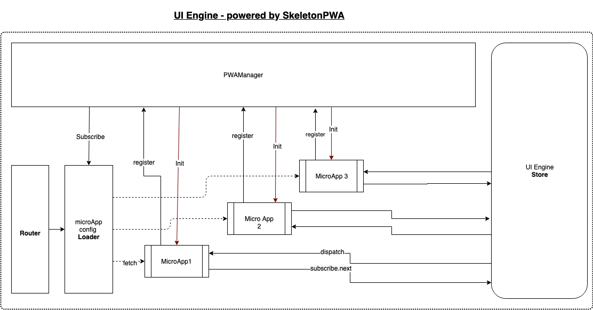

# Engineering resilient Micro Frontends

Over the last decade, AngularJS has been one of the "coolest kids on the block”, substituting several of the weaknesses that came with jQuery-based net engineering solutions. Many enterprises were extraordinarily happy building their fashionable net portals with AngularJS, and with the exponential growth of net businesses, AngularJS has made several developers’ lives easier.

Everyone was happy in the web development world, but this happiness didn’t last long.

## JavaScript and Big Ball of Mud

>While much attention has been focused on high-level software architectural patterns, what is, in effect, the de-facto standard software architecture is seldom discussed. This paper examines this most frequently deployed of software architectures: the BIG BALL OF MUD. A BIG BALL OF MUD is a casually, even haphazardly, structured system. Its organisation, if one can call it that, is dictated more by expediency than design. Yet, its enduring popularity cannot merely be indicative of a general disregard for architecture.- http://www.laputan.org/mud/

We started developing Innovaccer's healthcare data platform in November 2015; at that time, our application architecture consisted of a single page application, which was written in Angular1.3 because during that time, React was relatively new at building out a complex product for healthcare, and everybody on the team was better versed with AngularJs. Also, it was relatively easier to find developers experienced with this technology at that time.

During the time of its creation, our application had a well-defined architecture. The relentless onslaught of adjusting needs that any eminent system attracts will step by step undermine its structure. Systems that were once tidy become overgrown as piecemeal growth gradually allows elements of the system to sprawl in an uncontrolled fashion.

This system started showing unmistakable signs of unregulated growth, and repeated, expedient repair.
As with our decaying system, a downward spiral ensues. Since the system has become harder and harder to understand, maintenance has become more expensive and more difficult. The way to arrest entropy in the software package is to refactor it. A sustained commitment to refactoring can keep a system from subsiding into a chaotic state.
If such sprawl continues to be intense, the structure of the system will become so badly compromised that it should be abandoned.

Rewriting the whole frontend in React or Vue was not an option for us, especially in the modern JavaScript ecosystem, which is highly volatile and with ever-changing trends, we wanted to create an architecture that can be agnostic of the frontend framework being used by a particular team to build their web interface, and provide a scaffolding to include any of the existing frontend frameworks or if something better comes down the line, without shredding the existing application completely.

In our endeavor to refactor our existing single page monolith into a more elegant and performant architecture that is nimble in nature, we ended up creating UI Engine, which solves the complexity of engineering large scale JavaScript applications. In addition, it offers a flexible yet strict enforcement of certain essential rules, which are compulsory to follow as a precursor to building resilient web applications that a critical business sector like healthcare can rely on and are easier to test, maintain, change, and secure.

> TLDR: In recent years, thanks to Node.js, JavaScript has become the “lingua franca” of the web for both front and backend applications. This has given rise to awesome projects like Angular, React and Vue which improve developer productivity and enable the construction of fast, testable, and extensible frontend applications. However, while plenty of superb libraries, helpers, and tools exist for Node (and server-side JavaScript), none of them effectively solve the main problem - architecture.[1]

The engine is an [Inversion of Control Container] (http://martinfowler.com/articles/injection.html "Inversion of Control Containers and the Dependency Injection pattern") that solves the problem of architecture for large scale complex JavaScript applications.

> Loose coupling allows you to make changes to one module without affecting the others.

Writing JavaScript is very easy—almost anyone can learn and start developing User Interface with JavaScript or jQuery, AngularJS, React, Vue, etc., however, the difficult part is writing maintainable JavaScript.

We deployed our refactored frontend application by migrating each AngularJS application as a small micro frontend inside App Shell architecture provided by UI Engine, and all of the network calls, which were initially being triggered as cross origin from the browser to our backend services, were now proxied through an API gateway registered in UI Engine.

More tweaking was needed, as well as enabling HTTP/2 on nginx and the use of compression middleware on the node.js layer to compress all of the json and static resources; below are some screenshots of the first deployment on staging.innovaccer.com that we did in April 2018 compared to our legacy SinglePage AngularJS application on qa.innovaccer.com.


# Microfrontends

>Software architecture should never be an end goal, but a means to an end

The economy is powered by the bytes today, and in byte economy, the focus is on quickly bringing products to market.

In this competitive and disrupting decade of startups, where we see software companies becoming some of the world's most valuable companies ever created, startups spawn and die each and every day. To stay alive, we must sustain and gain a substantial chunk of the market share, and we want the factory running at top speed to produce software. These factories consist of sentient human coders who are working relentlessly to churn out feature after feature to deliver a user story, which is a composite part of the total structure of a software product.

In the beginning....

[](link)

We have ancient monolithic systems, where everything is bundled up inside a single deployable unit.
This is in all probability where most of the trade resides. Caveats apply, however, monoliths may be designed quickly and the area unit simple to deploy, but they provide limited agility because even tiny changes require a full redeployment. In addition, we understand that monoliths usually find themselves trying a huge ball of mud of sorts as a result of the software system evolving over time. For example, several monolithic systems are engineered employing a stratified design, and it's comparatively simple for stratified architectures to be abused (e.g., skipping "around" a service to access the repository/data access layer directly).

The application we are working on is a big client facing web application. Since the initial conception of the product, we have identified a couple of self-contained features and created microservices to provide each functionality. We have carved out bare essentials for providing the user interface, which is our public facing web frontend. This microservice only has one functionality, which is providing the user interface. It may be scaled and deployed, becoming independent from the composite backend services.

>If you can't build a monolith, what makes you think microservices are the answer?

If we talk about microservices in the technical sense, computing, storage and networks have become dirt cheap today, and the cost is rapidly declining. This trend has led to the development of tiny, independent full stack software, which is simply the evolution of light-weight service-oriented architectures if done right.

Microservices have rejuvenated the age-old idea of building a smaller, loosely coupled, reusable piece of software that does one thing and one thing well, emphasizing on shortest time to market and minimal cost. Again, caveats apply, however, if done well, service-based architectures buy you a lot of flexibility and agility because each service can be developed, tested, deployed, scaled, upgraded and rewritten separately, particularly if the services area unit is decoupled via asynchronous electronic messaging. The drawback is increased complexity as a result of your software having more moving elements than a rolling stone.

> The complexity is still there, you're just moving it somewhere else.

Thus, the same old concept just replaces the all in-memory function calls or shared library calls with remote network calls; now we can independently build, change, deploy and scale them with independent teams who don’t have to be compelled to understand the existence of different teams.

When you have an enormous monolithic frontend that can’t be split simply, you have to think about making it smaller. You can decompose the frontend into separate parts developed separately by completely different groups.

>When you are implementing a microservices architecture you want to keep services small. This should also apply to the frontend. If you don't, you will only reap the benefits of microservices for the backend services. An easy solution is to split your application up into separate frontends.

We have multiple teams that work on different applications. However, you're not quite there yet; the frontend is still a monolith that spans across the different backends. This means that on the frontend, you still have some of the same problems you had before switching to microservices. The image below shows a simplification of the current architecture.


Backend teams can't deliver business value without the frontend being updated, since an API without a user interface doesn't do much. More backend groups suggest that a lot of new options, and therefore more pressure, are put on the frontend team(s) to integrate new features.

To compensate for this, it is possible to make the frontend team bigger or have multiple teams working on the same project. Because the frontend still has to be deployed in one go, teams cannot work independently. Changes have to be integrated in the same project, and the whole project needs to be tested since a change can break other features. This would basically mean that the teams are not working independently.


With a monolithic frontend, you never get the pliability to scale across groups as assured by microservices. Besides not being able to scale, there is also the classical overhead of a separate backend and frontend team. Each time there is a breaking change in the API of one of the services, the frontend has to be updated— especially when a feature is added to a service, the frontend has to be updated to ensure your customers can use the feature.

If you have a frontend small enough that it can be maintained by a team who is also responsible for one or more services coupled to the frontend, then there is no overhead in cross team communication. However, because the frontend and backend cannot be worked on independently, you are not really doing microservices.


If you have multiple teams working on your platform, but also have multiple smaller frontend applications, there would be no problem. Each frontend would act as the interface to one or more services. Each of these services will have their own persistence layer. This is known as vertical decomposition.
Now, the major problem with achieving this kind of architecture with the frontend is user experience.
End users of the modern application product today have the perception that one company means one website.
However, as we discussed above, this approach becomes a development bottleneck and doesn't scale efficiently.

We will discuss some of the most popular ways to do the vertical decomposition for the frontend in order to achieve the following objectives:

* Team Ownership
* Develop Independently
* Run Independently
* Technology Agnostic
* Fast Loading
* Native Support
* Sharing Basics
* Modular
* Corporate Identity
* Smooth User Interaction

<!-- <div style="page-break-after: always;"></div> -->
## Hardcore Nginx Based Routing

What can we do if we want to get started in splitting our monolithic frontend single page application into multiple standalone single page applications served behind the nginx, which runs independently?  

[](link)

We can hyperlink different applications, however, each application would require the maintenance of similar base application templates in their code in order to achieve brand identity.

As you can see, this approach is fine to begin with, however, four of the very critical cases fail here.

| Passed              | Failed            |
| :-------------        |:-------------        |
| Team Ownership        | Sharing Basics       |
| Develop Independently | Modular              |
| Run Independently     | Corporate Identity   |
| Technology Agnostic   | Smooth User Interface|
| Fast Loading          |                      |
| Native Support        |                      |

So, what other options do we have ?

## Server Side Includes

There is another interesting approach we can use to achieve this, most popularly known as Edge Side Includes [ESI](https://en.wikipedia.org/wiki/Edge_Side_Includes).

> Edge Side Includes or ESI is a small markup language for edge level dynamic web content assembly.

[](link)

| Pass                  | Failed               |
| :-------------        |:-------------         |
| Team Ownership        |   Fast Loading        |
| Develop Independently |   Native Support      |
| Run Independently     | Smooth User Interface |
| Technology Agnostic   |                       |
| Sharing Basics        |                       |
| Modular               |                       |
| Corporate Identity    |                       |

<!-- <div style="page-break-after: always;"></div> -->

## Integration on Code Level

Well, this is how our existing frontend monolith is working, where we do code level integration of multiple angular modules into a final SPA build.


| Pass                  | Failed               |
| :-------------        |:-------------         |
| Team Ownership        |   Fast Loading        |
| Develop Independently |   Technology Agnostic |
| Native Support        |   Run Independently   |
| Smooth User Interface |                       |
| Sharing Basics        |                       |
| Modular               |                       |
| Corporate Identity    |                       |

Obviously, we have some workarounds which could help, but this approach also fails to be sustainable in the long run.

## App Shell

> Lets change the perspective a bit, and think outside the box

There is a good intro about this approach [here](https://developers.google.com/web/fundamentals/architecture/app-shell), which should set the context about this concept.

[](link)

> The App "Shell" is the minimal HTML, CSS and JavaScript required to power the user interface, and when cached offline, can ensure instant, reliably good performance for users on repeat visits. This means the application shell is not loaded from the network every time the user visits; only the necessary content is needed from the network.

This approach lends the ability to instantly load our application shell on the first visit, and the minimal amount of static resources required is cached on the browser.

Now, we can lazy load independent single page applications known as micro frontends into our shell as per user demand or intent.

[](link)

We can do this by providing routing information for each micro frontend.

[](link)

Followed by providing manifest json for each micro-frontend.

[](link)

Once we have loaded all of the necessary resources for the application, we can initialize the micro frontend application in the following way:

[](link)

If we evaluate this apporach on our test cases:

<!-- [](link) -->
| Pass                  |  Challenges           |
| :-------------        |:-------------         |
| Team Ownership        |  Modular              |
| Develop Independently |  Technology Agnostic  |
| Native Support        |  Sharing Basics       |
| Smooth User Interface |  Run Independently    |
| Super Fast Loading    |                       |
| Corporate Identity    |                       |

With this, the App Shell felt like the most appropriate approach to solving our frontend problem.

The engine is designed from the ground up to leverage application shell architecture. We achieve this by incorporating Design Pattern known as Inversion of Control, or IOC, containers on the browser and Nodejs layer, which help our applications to do Dependency Injection instead of doing direct source-code imports; this pattern helps us to build applications that provide low coupling and high cohesion.

Hence with UI Engine, developers can build their micro frontends, and each application can be coupled with a server part that provides view level RESTful APIs or exposes certain downstream services via API gateways that power applications registered in the App Shell.

# UI Engine

> Loose coupling allows you to make changes to one module without affecting the others.

Engine is a pluggable component-based application composition layer; it provides a well-defined place for creating, configuring, and *non-invasively* connecting together the components of an application, or sections of an application.

> **Web Application Module**  - an independent unit of functionality that is a part of total structure of web application.

With Engine, you focus on coding the application logic of components and let Engine handle the bootstrapping and the glue that connects them together. You write simple, declarative JavaScript modules that describe how components should be composed together, and wire will load, configure, and connect those components to create an application, and will clean them up later.

Engine is designed to take care of the connection points between existing popular frameworks and solve common integration problems that arise with engineering large scale complex JavaScript web applications, thus decoupling the whole application with implementation details of each application vertical, giving freedom to choose the UI stack from the likes of Angular, React, Vue, Mithril, etc.

Engine incorporates an [Inversion of Control Container](http://martinfowler.com/articles/injection.html "Inversion of Control Containers and the Dependency Injection pattern") for JavaScript apps.

> TLDR: In recent years, thanks to Node.js, JavaScript has become the “lingua franca” of the web for both front and backend applications. This has given rise to awesome projects like Angular, React and Vue, which improve developer productivity and enable the construction of fast, testable, and extensible frontend applications. However, while plenty of superb libraries, helpers, and tools exist for Node (and server side JavaScript), none of them effectively solve the main problem - architecture.[1]

## Features

Engine provides:

* Simple, declarative dependency injection
* A flexible, non-invasive connection infrastructure
* Application lifecycle management
* Powerful core tools and plugin architecture for integrating popular frameworks and existing code
* Application shell architecture and pluggable micro frontends
* Support for both browser and server environments

Apps constructed with Engine:

* Have a high degree of modularity
* Can be unit-tested easily because they inherently separate application logic from application composition
* Allow application structure to be refactored independently from application logic
* Have no explicit dependencies on DOM Ready, DOM query engines, or DOM event libraries
* Are designed to give you a quick and organized way to start developing micro frontends inside PWA shell
* Encourage the age-old idea of building a smaller, loosely coupled, reusable piece of software that does one thing and one thing well for quicker time to market and cheaper cost of change
* The engine package system allows developers to create modular code that provides useful tools that other engine developers can use. The packages, when published, are plug-and-play and are used in a way that is very similar to traditional npm packages
* The engine package system integrates all the packages into the engine project as if the code was part of the engine itself and provides the developers with all the necessary tools required to integrate their package into the host project
* Setup can be fanned out to run as **Distributed Frontend** architecture.

> Engine provides an out-of-the-box application architecture which allows for effortless creation of highly testable, scalable, loosely coupled, and easily maintainable large scale frontend web applications as a set of independent micro frontends.

Engine was developed as a very light and elegant layer, which permitted us to migrate our existing frontend monolith (Angular1.x) into separately installable packages. Each package can now be installed separately into Engine; each package can provide a complete frontend along with Rest-APIs for that engine application into a plug-and-play application framework.

If any module in Engine depends on any other functionality module in Engine, then there will be no explicit source code level dependency, but we utilize Dependency Injection to use the functionality exposed by a particular module.

The code snippet attached below describes how to define a package in Engine.

```js
const engine = require('engine-core');
const Module = engine.Module;
const SomeApp = new Module('SomeApp');//  Defining the Package
const ESI = require('nodesi').middleware;
/*
 * All engine packages require registration
 * Dependency injection is used to define required modules
 */
SomeApp.register((app, datastore, database, gateway, admin, sources, worksets) => {
  app.use(ESI(config.esiSettings));
  SomeApp.menus.add({
    title: 'SomeApp',
    link: '/app/someapp/main#/home',
    weight: 19,
    name: 'someapp',
    menu: 'care'
  });
  SomeApp.routes(app, datastore, database, admin);
  return SomeApp;
});
```

Engine provides us with the ability to do sort of a vertical decomposition without completely abandoning our existing system, rather than improving the performance of the existing angular application, along with the ability to develop new features and rewrite existing features to more modern and performance-oriented engine library such as React, Preact, Vue, Svelte, etc.

## Engine Test Cases

<!-- [](link) -->

| Passed                |  Failed               |
| :-------------        |:-------------         |
| Team Ownership        |  Run Independently    |
| Develop Independently |                       |
| Native Support        |                       |
| Smooth User Interface |                       |
| Super Fast Loading    |                       |
| Corporate Identity    |                       |
| Sharing Basics        |                       |
| Modular               |                       |
| Sharing Basics        |                       |
| Technology Agnostic   |                       |

Engine provides a nice and familiar ecosystem for every JavaScript developer to build, publish, and install their micro frontends into any engine-based projects using natively provided NPM cli tool in a true plug-and-play format.

[](link)

All of the applications created for Engine along with any JavaScript module which needs to be reused or plug-and-play are published to a private NPM registry hosted inside our network.

## A flexible and powerful yet simple architecture

[](link)

So far, we have been able to break down our large legacy UI monolith into standalone micro applications that can be used like traditional npm packages, as each engine package is a web application middleware. The application shell provided by UI Engine works as a stitching layer, as it composes the seamless UI from individual packages and a dockerized image is published for the UI.

In order to run each engine packages as a standalone micro application, thus fanning out in a distributed fashion, we need to understand the main components which answer the essential requirements of micro frontend architecture stated below.

### Client-Side

* Orchestration
* Routing
* Isolation of micro applications
* App to app communication
* Consistency between micro applications UIs

### Server-side

* Server Side rendering
* Routing
* Dependency management

In order to address the requirements of the client side, we have four essential structures provided by UI engine: PWAManager, Loader, Router and UI Engine Store.

[](link)

### PwaManager

  PwaManager is the core of the client side micro application orchestration. The main functionality of the PwaManager is to create a dependency tree. Once all the dependencies of the micro application are resolved, PwaManager starts the micro application.

### Loader

  Loader is one of the most essential parts of the client side solution offered by UI Engine. It is the responsibility of the loader to fetch unresolved micro applications from the server.

### Router

  In order to solve the client side routing problem, UI Engine provides a router; the router is primarily used to resolve micro applications by handling top level routing for each application and delegating the further process to the respective micro application. Let's say we have an application with the URL like `/sources/view/123` and an app named SourcesApp. In this scenario, the UI Engine router will resolve the URL up to `/sources/*` and will call SourcesApp with the `/view/123` part.

### Store
  
  The store is used to solve the problem of communication between multiple applications on the client side; this store is modeled along the lines of Redux.

### Micro Appserver

[](link)

The micro appserver is responsible for initializing and serving the micro application.
Whenever a micro application server is spawned, the first thing it does is call the register endpoint provided by StitchingServer with application manifest, which defines the dependencies, type and URL schema.

### Stiching Server

StitchingServer provides a register hook for MicroAppServers. Once a MicroAppServer registers itself to StichingServer, StitchingServer records the manifest of the MicroAppServer.

Later, the StitchingServer uses the manifest declaration to resolve the MicroAppServers from the requested uniform resource locator.

After resolution, MicroAppServer and every one of its dependencies, all relative methods in CSS, JS and hypertext mark-up language are prefixed and connected with the MicroAppServer public uniform resource locator. One further step is prefixing the CSS selectors with a singular symbol of MicroAppServer to stop collision between micro applications on the client side.

Then the most responsibility of StitchingServer comes onto the scene—composing and returning a seamless hypertext mark-up language page from all collected components.

[](link)

## Conclusion

Micro frontend is a relatively new terminology, crowned as recent as 2016; however, there have been a lot of large companies who have tried to solve similar problems like Facebook with its [BigPipe](https://www.facebook.com/notes/facebook-engineering/bigpipe-pipelining-web-pages-for-high-performance/389414033919/).

Zalando open-sourced its solution which is called Project Mosaic.

There is a framework already out there called [single-spa] (https://single-spa.js.org).

The topic of micro frontends is being discussed quite a lot; web components-based development strategies have been gaining substantial momentum, and I believe this topic will be discussed more frequently in time.

Over the coming years, I hope this will become the defacto way of development in large teams.

### Resources

Readers should go through this [presentation](https://www.slideshare.net/nzakas/scalable-javascript-application-architecture) by Nicholas Zakas, who has been inspiration and motivation behind Engine.

[Gain momentum on the road to a new long-lasting and future-proof frontend architecture!](https://micro-frontends.zeef.com/elisabeth.engel?ref=elisabeth.engel&share=ee53d51a914b4951ae5c94ece97642fc)

[Youtube Playlist on Microfrontends](https://www.youtube.com/playlist?list=PLI1AtZo9B3YL_xpi19IuxFcTuCi2_thQT)